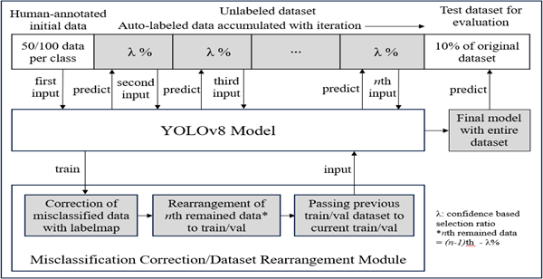
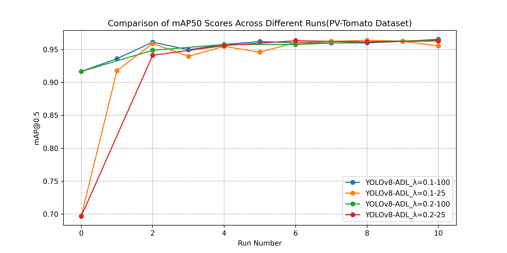
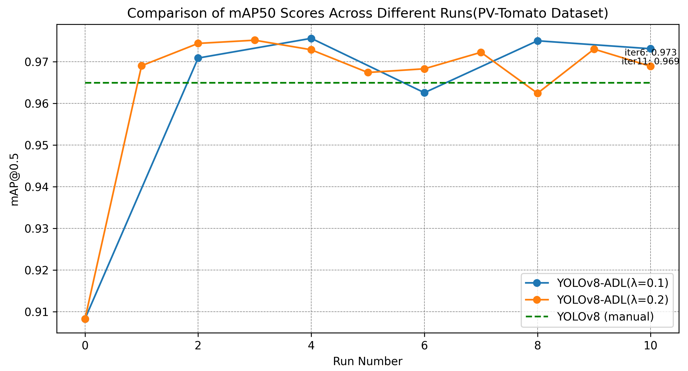

# YOLOv8-ADL
This project is implemented system based on the paper: “Automated Data Labeling for Object Detection via Iterative Instance Segmentation” IEEE International Conference on Machine Learning and Applications (IEEE ICMLA 2023), Conference Date: Dec 15-17, 2023.


## Paper Information
“Automated Data Labeling for Object Detection via Iterative Instance Segmentation”
IEEE International Conference on Machine Learning and Applications (IEEE ICMLA 2023), Conference Date: Dec 15-17, 2023.
•	As the First Author, developed and programmed an auto-labeling system using YOLOv8 with its instance segmentation technique, integrating with uncertainty-based correction algorithm and iterative training to reduce the need for manual labeling
•	Adopted the concepts of semi-supervised and active learning methods to refine the system
•	Processed and adapted the PlantVillage Dataset, featuring over 20,000 data instances for our experiments
•	Set new benchmarks in accuracy and efficiency, outperforming traditional models and the model conventionally trained on fully human-labeled dataset

## Dataset and Weights Record
**Python Version: 3.11**

Dataset: [https://drive.google.com/file/d/1I50YT0P73zL45DPrx8pa9_ftlWiHrddC/view?usp=drive_link](https://drive.google.com/file/d/1I50YT0P73zL45DPrx8pa9_ftlWiHrddC/view?usp=drive_link)  
Weights: [https://drive.google.com/file/d/1u1Py1oKQxPzCRwT7BDDyA8wXUkZM2PTi/view?usp=drive_link](https://drive.google.com/file/d/1u1Py1oKQxPzCRwT7BDDyA8wXUkZM2PTi/view?usp=drive_link)

## Clone the Repository
First, navigate to the directory where you want to store the project in the terminal. Then, clone the project repository:

```
git clone https://github.com/jinyoonok2/YOLOv8-ADL.git
cd YOLOv8-ADL
```
or you can use github Desktop to alternate this process.

## Images




Thank you for reading.
